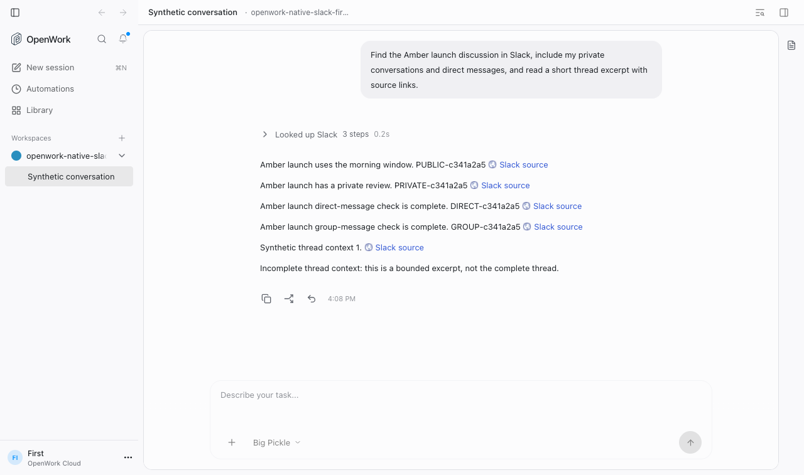
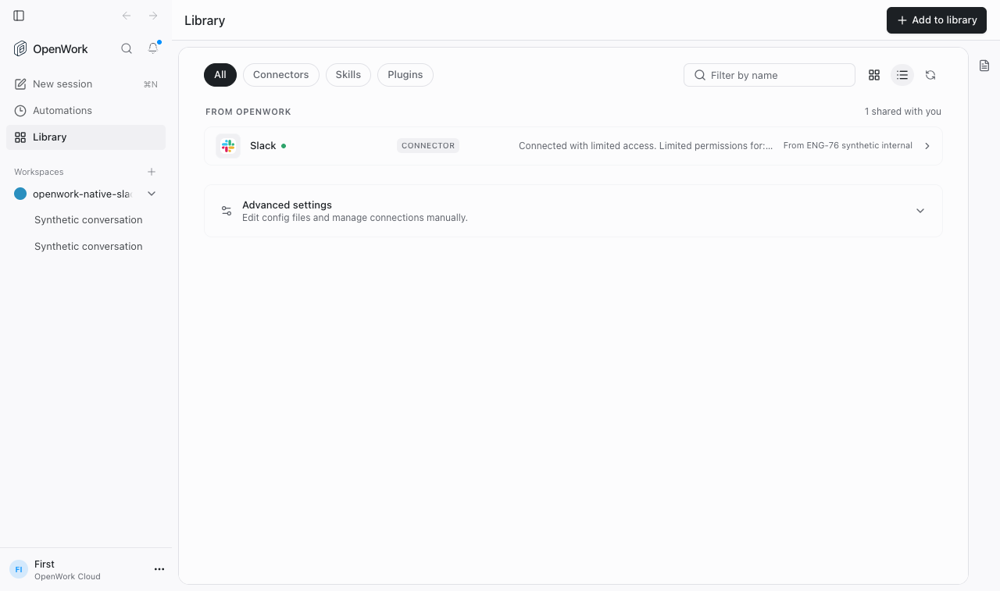

# ENG-76 implementation verification

## Rebase verification — 2026-09-30

Rebased all ten commits onto `origin/dev` at `628ffa455`. Conflict resolution
preserves dev's audit/App test chains and adds the Slack suites; the OpenAPI
snapshot and SDK were regenerated from the combined routes. The checked code
head is `8ee0bedf4`.

- `pnpm --filter @openwork-ee/den-api test:slack-native`: exit 0, 124 passed.
- `pnpm --filter @openwork-ee/den-web test:slack-native`: exit 0, 11 passed.
- `pnpm --filter @openwork/app exec bun test tests/native-slack-connection-view.test.tsx`:
  exit 0, 12 passed.
- Den API (`exec tsc --noEmit --pretty false`), Den web, and SDK typechecks passed.
- `pnpm api:lint`: exit 0, 0 errors and 39 warnings.
- `pnpm evals:e2e native-slack-connect --local --engine v2`: exit 0,
  1 passed, 0 failed, 0 skipped, 128 seconds. Placement: `local (--local)`;
  cold-booted against the synthetic providers with both pinned engines and
  temporary Chrome. The evidence record has 12 passing expectations and ten
  unvalidated screenshots; automated visual verification remains incomplete.
  Run receipt: `evals/results/.testkit/cli-run-1790775626981-9902.json`.
- App typecheck: exit 2, `mcp-app-frame.tsx:871` uses `Promise.withResolvers`
  outside the configured TypeScript library. The exact single-package command
  reproduced the same error on a clean `628ffa455` control checkout.
- `pnpm evals:typecheck`: exit 1, `mcp-app-servers.e2e.test.ts:10` supplies a
  world with an incompatible second parameter. The exact command reproduced
  the same single error on the clean control after installing both workspace
  dependency sets. Neither type error was introduced by this branch.

Commands above also supplied `--config.verify-deps-before-run=false`.
Generation required rebuilding workspace dependencies added by dev and a
disposable local Docker MySQL schema for auth initialization. The earlier
2026-09-28 suite and screenshot results below describe the pre-rebase tree.

## Result

Native Slack is implemented behind a default-off organization/workspace gate.
The synthetic browser journey passed on implementation commit
`13921ceb3d748c851f7b6ae4ff2b088c32194f1c` (2026-09-28).
This verifies app-web, the pinned V2 engine, Den OAuth/storage, and normal
Connect discovery/execution against synthetic Slack and model HTTP servers.
It is not a packaged-desktop or live Slack acceptance result.

The journey proves member authorization, all four conversation categories,
source links, bounded thread excerpts, two-member private-content isolation,
partial consent, wrong-workspace/organization rejection, retained-capability
denial after disablement, and disconnection of a blocked saved account.

## Checks

Commands use pnpm; `--config.verify-deps-before-run=false` was supplied to avoid
rechecking the already prepared workspace dependencies.

| Command | Result |
| --- | --- |
| `pnpm evals:e2e native-slack-connect --local --engine v2` | Exit 0: 1 passed, 0 failed, 0 skipped |
| `pnpm --filter @openwork-ee/den-api test` | Exit 0: 422 passed, including 124 dedicated Slack tests |
| `pnpm --filter @openwork/desktop test:core` | Exit 0: 156 passed |
| `pnpm --dir evals run test:core` plus targeted reruns | All 11 passed: 8 initially, 3 after selecting the pinned engine (see below) |
| `pnpm test` | Exit 1: app 399 passed; server 201 passed, 1 failed, 1 skipped; later packages not reached by this command |
| Den API, app, Den web, and evals TypeScript checks | Passed |
| API snapshot and SDK generation/typechecking | Passed |
| `pnpm api:lint` | Exit 0: 0 errors, 39 warnings |

The passing journey reports `placement: local (--local)` and uses both
repository-pinned engine binaries plus temporary Chrome-for-Testing.
The earlier automatic run reports `placement: daytona (daytona CLI authenticated)`:
**incomplete, 1 skipped — needs co-located synthetic native HTTP fixtures**.
The user explicitly authorized the additional local run.

The initial eval-core command used the unrelated `opencode` on the shell PATH:
three engine-startup checks failed and eight route checks passed. Each failing
spec then passed individually with the repository-pinned V1 binary selected via
both `PATH` and `OPENWORK_OPENCODE_BIN`: `effective-permissions-attribution`,
`thread-approvals-replay`, and `pdf-attachments-model-routing`. This was an
environment correction; no test or production source changes were needed.

The root-suite failure is `apps/server/src/serve-node.test.ts:126`: a raw HTTP
assertion expects JSON at the end of a chunked response. The same exact targeted
command (`pnpm exec bun --conditions=development test src/serve-node.test.ts`)
reproduced 34 passed/1 failed on both the implementation and clean original base
`8e52796a162badffdac2b9b5998c804114e69bd4`, using Bun 1.4.2.
No transport code or assertions were changed to hide that failure.
The migration test is **skipped — needs `OPENWORK_MIGRATION_LIVE_TEST=1`,
`OPENWORK_MIGRATION_V1_BIN`, and `OPENWORK_OPENCODE2_BIN`**.

## Screenshots

These are actual screenshots from the passing synthetic journey, visually
inspected during implementation. The evidence recorder retains ten screenshots
as unvalidated image artifacts; no automated visual-judging pass is claimed.
Design rules applied: P1 (truthful state), P4 (blocked account remains manageable),
P5 (existing Connect controls), P10 (screenshots), and C5 (neutral blocked state).

The full local record is under
`evals/results/test-runs/2026-09-28T14-06-57-367Z-30191-an-internal-member-connects-their-own-slack-reads-linked-excerpts-and-cannot-len/`.

## Review and activation

Standards and spec reviews found and resolved the rotating-user-token response
contract, blocked-account visibility, and accurate policy-owner attribution.
Two duplication suggestions remain nonblocking. Refresh concurrency across
deployment instances remains a separate live-activation check.

No real Slack app, credentials, installation, enablement, or provider outreach
was performed. Live eligibility, minimum in-Slack experience, provider setup,
and packaged OAuth handoff remain pending. See
[the operational draft](../../slack-native-preview-setup.md).

## Local cleanup

The isolated Compose project `openwork-eng-76-validation` was taken down after
verification, removing its MySQL/Redis containers and network. Colima profile
`openwork-eng76-validate` was stopped and its stopped state confirmed.
