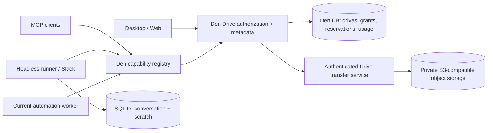

# Cloud Drive architecture

Proposal at upstream `dev@74232f4c1`; all structures and routes below are new
designs, not existing contracts.

## Put the durable drive in Den



Den remains the identity, organization and policy authority. Use the current
`mcp/capability-registry.ts` / catalog discovery conventions for Drive tools and
`mcp/auth.ts` to identify the caller. Reuse organization membership and team
assignment patterns. Inspect existing credential storage before implementing
Drive secrets; do not invent a new encryption/key management scheme in a feature.

No shared provider credential or cross-member S3 key goes to the runner, browser
or model. A caller cannot supply another `memberId` to become that person.
All object lookups bind organization, drive, current active member and grant.
The runner's service-authenticated `/files` endpoint is not a member API.

The existing run token authenticates the actor but does not provide narrow
Drive scope. Add a server-side run context keyed to the minted token/run id,
containing allowed drives, folders, operations, expiry and a total write cap.
Resolve it in the Drive service. Effective access is **current membership and
grants ∩ organization policy ∩ run scope**. Request bodies cannot broaden it;
`mcp:write` alone is insufficient. Signed-in interactive callers use their
ordinary current permissions. The model prompt is not an authorization gate.

## Storage configuration and namespace

Profiles contain `id`, `organizationId`, `kind: managed | s3`, `endpoint`,
`region`, `bucket`, `forcePathStyle`, `credentialRef`, `rootTemplate`,
`capabilities`, `verificationState`, `verifiedAt` and `revision`. Credentials
can be role/workload identity where available, or operator-held access key,
secret and optional session token. The UI accepts and rotates secrets through
the supported server secret service, returns only masked state, and never
round-trips raw secrets. No secret is kept in a local-storage preference.

An organization sets a default profile; an explicit member assignment can
override profile, root and quota. A separate key pair per user is optional
backend defense, not necessary for normal Drive isolation. Profile credentials
are restricted to the configured bucket/root; the operator supplies lifecycle
and encryption configuration rather than requiring account-wide permissions.

Admin-configured template, expanded from trusted opaque identifiers:

```text
organizations/{organizationId}/members/{memberId}/
```

Allow only documented identity placeholders. No email, free-form username,
caller-supplied variable, absolute path, traversal or ambiguous expansion.
Templates must be collision-free across assignments. A production physical key
can look like:

```text
<configured-root>/objects/<objectId>/<versionId>
```

Display paths such as `Reports/automations/daily-summary.md` live in metadata,
not in the physical key. A rename/move updates metadata; it does not duplicate
the blob. Folder boundaries and ACLs use stable folder IDs. Team drives get
their own organization-owned drive ID and root. Shared grants refer to that
drive or to a private-drive folder; sharing does not copy the content.

Existing external bucket trees are not auto-imported. Managed Drive objects
must be exclusive to the Drive service; out-of-band writers break accounting
and immutability. A later external-folder mount can start read-only, with an
explicit import/index contract. Changing a live profile's root or bucket is a
migration, not a settings edit; credential rotation does not relocate objects.

Endpoints come from authorized operator configuration, never a tool argument.
Use the existing outbound-request protections, validate TLS/DNS/redirects,
and explicitly allow a self-hosted private-network endpoint such as MinIO only
in the operator's deployment policy. Do not turn arbitrary endpoints into an
internal network proxy.

## Proposed data model

| Record | Main responsibility |
| --- | --- |
| StorageProfile / StorageAssignment | Server storage location, credential reference, effective member mapping |
| Drive | Organization, owner membership or team, pinned profile/root, status |
| Folder / Entry | Stable hierarchy, normalized display name, current version, revision, trash state |
| ObjectVersion | Opaque object key, verified size, media type, integrity value, scan state, physical deletion state |
| FolderGrant | Member/team, folder, operation set, allow/deny, inheritance, policy revision |
| QuotaAccount | Member, team-drive or org pool: physical used bytes, reserved bytes, hard ceiling |
| UploadIntent / TransferAttempt | Actor, run, target, declared bound, reservation, immutable key, expiry, idempotency fingerprint, lifecycle |
| DriveUsageEvent | Unique event identity, subject, physical byte delta, event time, backend, run attribution |
| DriveAuditEvent | Authorized operation, actor/run, target IDs, policy result; no tokens or signed URLs |
| RunDriveScope | Token/run binding, folder/operation intersection, expiry and aggregate run write reservation |

Use the repo's Drizzle/type-id conventions. Keep all foreign references scoped
to the organization; test object-ID guessing, cursor leakage and membership
removal. Store bytes in S3, not the Den relational database. Original content,
filenames and extraction results stay private; audit and telemetry need their
own explicit redaction/retention design.

Existing inference and gateway usage tables supply useful ledger and pending
reservation patterns. Their currencies/token counts and AuditUsageFact's
operation-count delta are not storage meters. Use a separate byte/time ledger
and integrate its verified totals into the commercial billing layer.

## Folder patterns and grants

The admin controls two distinct things: **physical root template** and
**logical folder access**. Treating a bucket prefix as a permission UI would
couple sharing to storage migration.

Expose folders in ordinary controls; advanced provisioning can use anchored
patterns like `Reports/**`. Initially support only an exact folder and its
descendants, or `**`; no arbitrary regex. Resolve patterns to stable folder
grants at provisioning, inheriting to descendants without trusting a client
path string. Deny overrides allow; no match means deny. A broader inherited
allow does not erase a narrower deny.

Operations are `list`, `read`, `create`, `update`, `trash`, `share`. A team
viewer gets list/read; an editor gets explicitly assigned edit operations.
Members cannot grant more than their share authority permits. Storage admins
can configure capacity without gaining ordinary content-read access.

Authorization precedes metadata listing, pagination, search and content
transfer. A move requires authorization at both source and destination, uses
entry revisions to prevent stale overwrites, and recomputes effective grants
without carrying unauthorized access into a new folder.

Example automation: input `Reports/**` read, output
`Reports/automations/**` create, 20 MiB aggregate run write cap. Member-wide
Drive access cannot expand that run. Losing a team grant blocks the next read
or write. Expired tokens do not refresh themselves.

## Upload and recovery protocol

1. `POST /drive/upload-intents`: authenticate; resolve the target by drive and
   folder IDs; validate filename/type and upload byte bound. In one transaction,
   lock applicable member/drive, org-pool and run budget rows in a fixed order,
   then reserve capacity. Require a caller-scoped idempotency key; reusing it
   with a different target/size/payload fingerprint returns conflict.
2. Allocate a fresh opaque object-version key. `PUT /drive/upload-intents/:id`
   carries bytes through an authenticated bounded transfer path. Bind the
   intent to its actor/run, expiry and reservation; a persisted attempt claim
   permits only one active writer. Count actual stream bytes with backpressure;
   terminate above the reservation or file cap. Never buffer a large body in
   Den. Abort incomplete multipart transfers and record cleanup debt.
3. Recheck membership/grants/intent liveness and target revision before commit.
   Verify size and a supported integrity check from storage; ETag is not a
   universal checksum. Keep the object unavailable until scan/type checks pass.
   Host HTML/SVG and other active content in an isolated preview origin, or
   serve as attachment; never render it on the authenticated app origin.
4. In one DB transaction, attach the verified immutable version to the entry,
   convert its reservation to used physical bytes, and write one unique usage
   event. A repeated complete request returns the same file reference; it
   never double-charges. Writes use the expected entry revision. Retained
   previous versions count separately until deletion is confirmed.
5. If an object write succeeds and DB finalization fails, a reconciler inspects
   the persisted intent and object to complete or delete it. It does not repeat
   an unknown tool side effect blindly. An expired empty intent releases its
   reservation; an intent with partial/unverified bytes retains cleanup
   accounting until abort/delete is acknowledged. Quarantine is not free.

Visible states refer to the file: uploading, ready, blocked, failed, unverified.
Provider outage keeps the last confirmed file list visible with its timestamp;
it does not show a misleading empty drive or erase a successful prior result.
Lowering a quota below current use blocks new growth and leaves existing reads
available. Trash/old versions continue to count until physical deletion.

The streaming route checks policy on admission and commit, with cancellation
on known revocation and bounded transfer leases. Already delivered bytes cannot
be recalled. Hard storage ceilings are enforced on retained bytes plus maximum
in-flight bytes; bounded temporary provider and buffer overhead must be
specified. A provider outage can delay cleanup. Keep reservations conservative
and expose reconciliation debt operationally.

For downloads, start with authenticated streaming too: folder changes take
effect on subsequent authorization, and byte delivery can be metered. A later
short-lived presigned download optimization must disclose that an issued URL
survives Drive-grant revocation until expiry and that direct egress accounting
needs provider-observed data, not URL-issuance counts.

## APIs and agent capabilities

Proposed user routes: list drives; list authorized folder entries; create
folder; begin/upload/complete transfer; read/download content; move/rename with
revision; trash/restore; grants; usage. Admin routes: profiles, safe connection
probe, assignment and quota policy. Schema changes require the live Den
OpenAPI/SDK contract workflow when this becomes implementation work.

The capability registry should expose discoverable `drive.list`,
`drive.read_text`, `drive.create_text`, `drive.save_result` and `drive.usage`
operations under existing search/execute conventions, rather than an
independent MCP server. Names are provisional. Grant/share and destructive
operations follow existing write-scope and consent conventions.

Use explicit invalidation or an authoritative liveness check for transfer
commit and grant changes. Today's MCP membership lookup uses the organization's
membership cache; merely calling that function again does not by itself prove
immediate revocation if cached membership remains valid.

Read returns a bounded extract and a file reference; binary transfers are not
base64 tool output. Saving a scratch file across services requires a trusted,
scoped transfer operation, not a caller-provided URL (SSRF) or direct access to
the runner's service file route. Small generated text can use `create_text`.
Returned references contain IDs, display path, verified size/revision and an
authenticated application link, never provider credentials or a public URL.

Idempotency binds run ID + tool-call ID to the write intent. On a resumed run,
look up the effect by that identity before deciding whether to retry. Today's
runner records unknown tool effects as errors instead of replaying them;
Drive capabilities should expose enough result lookup to preserve that policy.

## Compatibility contract

Use an S3 SDK adapter with an explicit endpoint/region/path-style profile.
Required primitives: put/get/head/delete and multipart create/upload/complete/
abort for bounded streaming. Browsing uses DB metadata, so object-list APIs are
for reconciliation/operations, not user ACLs. A provider capability probe must
verify the actual configured backend; an endpoint name is not certification.

Do not require bucket ACLs, AWS IAM APIs, STS, KMS, event notifications, provider
versioning or object tags for the portable baseline. Require private storage
and encrypted transport/at-rest provider policy. Optional checksum,
conditional-write, lifecycle and encryption extensions are capability-gated.
Application-owned immutable version keys avoid provider versioning as a
prerequisite. Retention and cleanup use our recorded state plus a reconciler.

AWS S3, R2 and self-hosted MinIO are candidates for initial compatibility
coverage, not verified support claims. R2 publishes a subset of S3 operations;
notably its compatibility table excludes S3 ACL and several encryption/
versioning operations. AWS conditional writes and R2 conditional headers can
provide extra immutability protection where verified. The service still owns
upload claims and accounting.
[R2 compatibility](https://developers.cloudflare.com/r2/api/s3/api/),
[AWS conditional writes](https://docs.aws.amazon.com/AmazonS3/latest/userguide/conditional-writes.html).

## Commercial accounting

Meter `physical bytes × elapsed seconds` from verified byte-delta events, with
idempotent ledger writes and backfilled reconciliation. Specify the commercial
GB convention separately; the preview displays binary GiB/MiB. Proposed monthly
capacity usage is average retained bytes above the included allocation,
integrated over the billing period. Apply the included allocation in time, not
once at month end. Shared-drive bytes charge the org/team pool, never every
recipient; member attribution remains available for admins.

Track transferred bytes, provider operations, scan/extraction work, retained
versions, trash and cleanup debt as cost dimensions from the start. Recommend
storage as the initial billable unit with clear fair-use transfer/operation
limits; do not price raw request counts before the product needs it. Caps and
reservations remain separate from billing rollups.

Default to a hard ceiling. Paid expansion requires an admin's explicit opt-in
and a maximum budget, with visible forecasts/alerts. Self-hosted profiles have
the same quotas but `billingOwner: operator`; OpenWork never charges their
provider storage usage as managed storage. Hosted storage is an add-on service
that can also be offered to customers running desktop locally: purchasing
storage need not imply purchasing a cloud computer.

Reconciliation compares recorded live objects and incomplete transfers to
provider reality; missing events/cost data mark the period unverified. Billing
must never silently use client-declared sizes or a count of issued URLs.
Define currency rounding, grace periods, removal/export and deletion retention
before enabling collection. No commercial amount is chosen in this proposal.

## Focused implementation proof

- Two organizations and two members: no leaked lists, IDs, cursors or content.
- Team read-only grant and explicit deny override a broad allow.
- A narrow run cannot read another folder, write outside outputs or exceed its
  aggregate cap; membership/grant revocation blocks commit.
- Two concurrent reservations cannot exceed member plus org ceilings.
- Retries and crash-after-upload do not double-store or double-charge.
- Oversize/chunked uploads, incomplete multipart and scan failure keep the
  namespace private and accounting conservative until cleanup succeeds.
- Restore/version retention and quota reduction preserve correct accounting.
- The same transfer protocol works on AWS S3 and one non-AWS backend, with
  unsupported extensions handled explicitly; use the admin-selected backend
  for self-hosted proof before declaring it supported.
- The user can upload, attach, save, retrieve and see a blocked limit through
  the real authorized capability path. CI's evidence specs prove shipping UI;
  the local concept alone does not.
